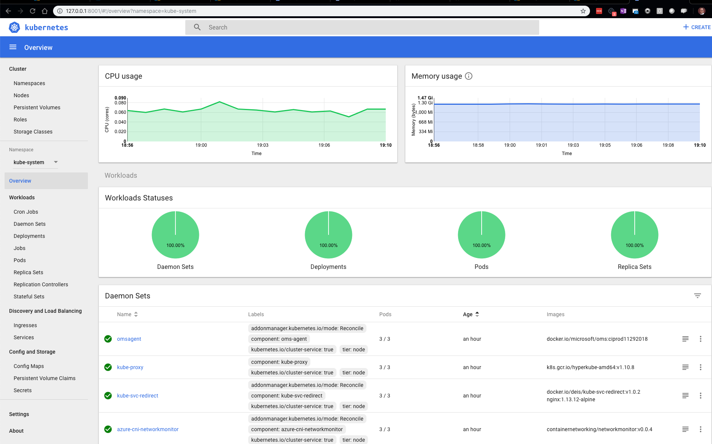

# Kubernetes Dashboard #

To view the dashboard and admin the cluster you need to do the following Steps

[Based on this Microsoft doc](https://docs.microsoft.com/en-us/azure/aks/kubernetes-dashboard)

1. Ensure you have ClusterRoleBinding setup b/c all AKS clusters are now RBAC by default, in addition to the template settings. `kubectl create clusterrolebinding kubernetes-dashboard --clusterrole=cluster-admin --serviceaccount=kube-system:kubernetes-dashboard`

1. Browse Dashboard `az aks browse --resource-group AKSCluster` (put in --name param with proper name)

If it worked you should see something like This

