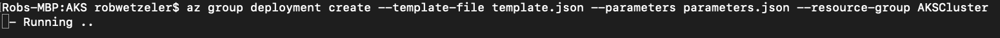
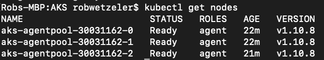

## Standup an Azure Kubernetes Cluster ##

`az group deployment create --template-file template.json --parameters parameters.json --resource-group AKSCluster`

## Set default credentials ##

`az aks get-credentials --resource-group AKSCluster --name wws-agrisync-aks-etl2 --overwrite-existing`

## Check Config ##

`kubectl get nodes`

