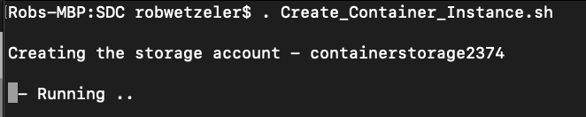
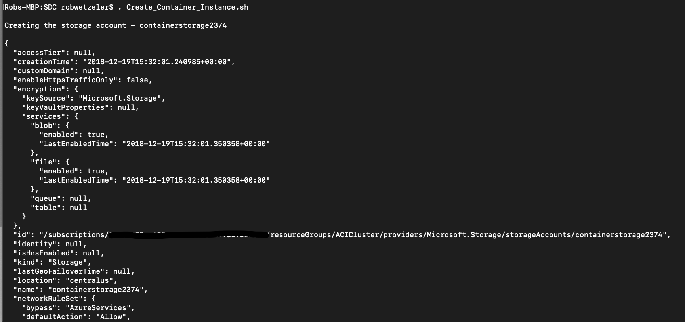
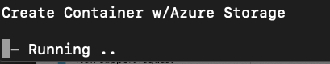
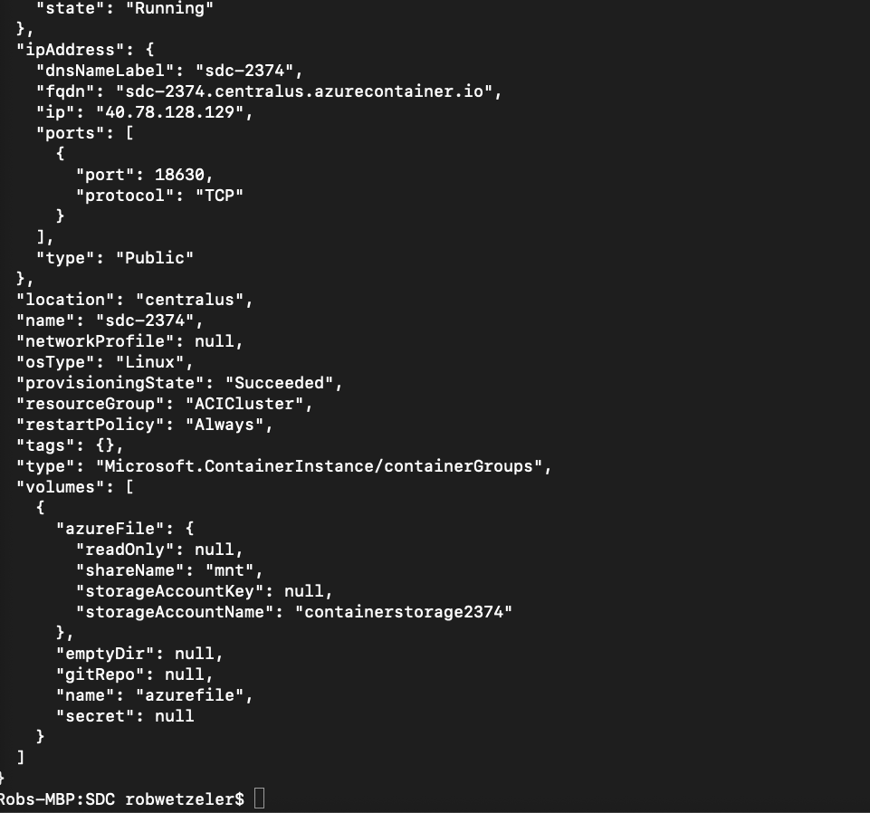
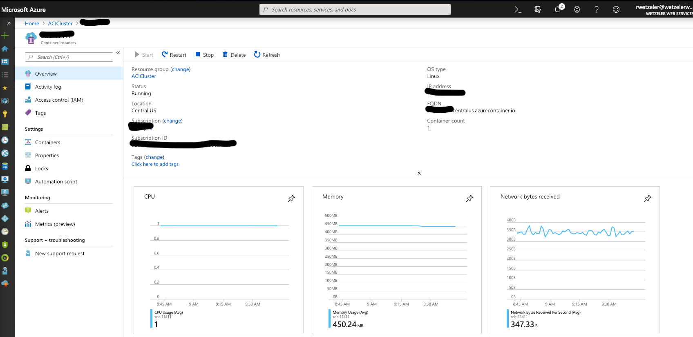
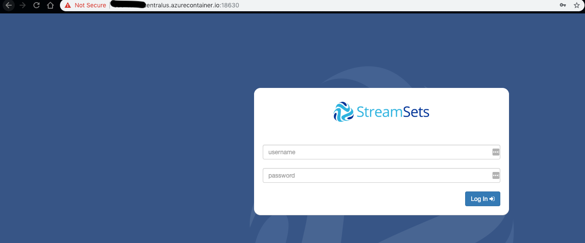
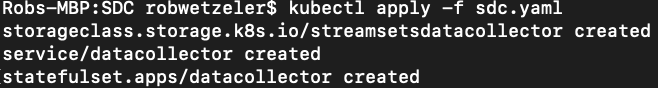

# StreamSets Data Collector Container #

My goal was to make it easy to run SDC from various platforms within the Azure Cloud.  Below you will find instructions on how to do this.

# Table of Contents
1. [Azure Container Service Instance](#aci)
    * [One Volume Mount](#onevolume)
    * [Multiple Volume Mounts](#multiplemounts)
1. [Kubernetes Instance](#aks)
1. [References](#references)

## Steps to run in Azure Container Services

### With One Azure Storage Volume Mount
*Note: You can eitehr A) Create the storage ahead of time and referend or B) run the script that will do it in one shot*

1. Open the [Create_Container_Instance.sh](Create_Container_Instanace.sh) file and either modify or run it.  *Note you will need to login to Azure CLI via `az login`*

#### What does this do?
1. Gets a random integer and will create new Azure File storage naming it as `containerstorageXXXX`

1. Create a file share from this new storage with file share name `mnt`  will echo the Key in case you need it later.

1. Create a new Azure Container Instance via the image [rwetzeler/StreamSets-dc](https://hub.docker.com/r/rwetzeler/StreamSets-dc) (or pick your own) and mount the new volume to the container.

2. Navigate to the Azure Portal and see it running

3. Navigate to your new instance using port 18630 and login with admin/admin or whatever default settings from the image you used.
*Accept certificate warning - take care of signing that later.*

**Result:** A running SDC Container with persisent storage mounted as a volume for SDC_Data and SDC_Logs

### With Multiple Azure Storage Volume Mounts (*WIP*)
This is slightly more tricky.  ACI via Azure CLI doesn't allow you to mount multiple volumes in one shot, and for that matter, there is no CLI API to add/modify a container setup to add more volumes later.
1. Use the templates with template.json and parameters_example.json 
(make it to your liking)

**Result:** A running SDC Container with persisent storage mounted with multiple volumes - I use this to have a shared SDC_CONF that all my container instances and use.

## Setup StreamSets Data Collector in Kubernetes (*WIP*)

1. Create Docker Container yaml file or use your favorite version
1. Apply the file to your Kubernetes Cluster

1. You may need to fix security so that SDC can work with the Azure Load Balancer

`kubectl create clusterrolebinding datacollector --clusterrole=cluster-admin --serviceaccount=default:kubernetes-dashboard
`

https://docs.microsoft.com/en-us/azure/container-instances/container-instances-volume-azure-files

## References 
[Based from this post](https://StreamSets.com/blog/scaling-StreamSets-kubernetes/)
[StreamSets](https://streamsets.com/)
[StreamSets Docker Container](https://hub.docker.com/r/streamsets/datacollector/)
